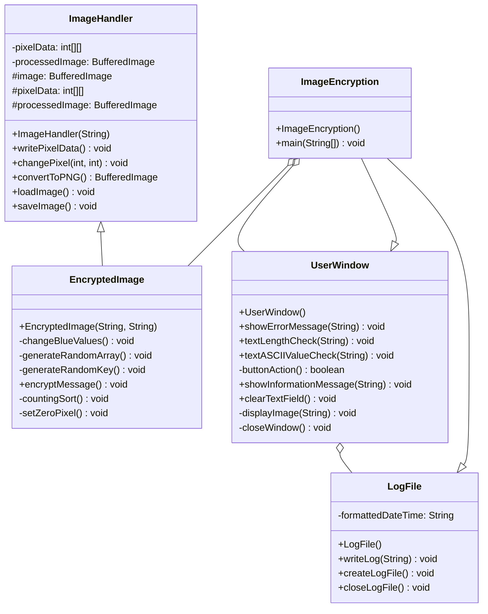

# Image Steganography Tool
**Java-based message encryption/decryption using RGB pixel manipulation**  
[](https://www.oracle.com/java/)

<p align="center">
  
</p>


## Key Features
### 🔒 Encryption
- **Message Embedding**: Hides ASCII text in PNG/JPG images via blue channel manipulation
- **Security Mechanisms**:
  - Random key generation (0-255 range)
  - Pixel shuffling algorithm
  - Counting sort synchronization
- **Image Processing**:
  - Automatic PNG conversion
  - 50x50 pixel size validation
  - RGB value modification tracking

### 🔓 Decryption 
- **Message Extraction**: Retrieves hidden text from encrypted images
- **Data Recovery**:
  - Reads metadata from (0,0) pixel
  - Dual-array synchronization
  - Custom counting sort implementation

### Class Diagram



## Technical Highlights
| Component          | Implementation Details                          | OOP Concept Used       |
|--------------------|-------------------------------------------------|------------------------|
| Pixel Manipulation | `BufferedImage` RGB modification                | Encapsulation          |
| Log System         | Thread-safe buffered writer                     | Singleton Pattern      |
| Validation         | ASCII range + length checks                     | Exception Handling     |
| Image Processing   | Inheritance from `ImageHandler` base class      | Inheritance            |

## Documentation
- **Algorithm Flow**:
  1. Generate random key (0-255)
  2. Modify conflicting blue values
  3. Encode metadata in (0,0) pixel:
     - Red: Message length
     - Green: Encryption key
  4. Distribute message chars using shuffled indices

- **Log File Sample**:
```
Window created. 16:54:55 25 May 2024
File loaded: image.jpg 16:55:15 25 May 2024
File name: image 16:55:15 25 May 2024
File type: jpg 16:55:15 25 May 2024
File dimensions: 50x50 16:55:15 25 May 2024
File converted to PNG: image.png 16:55:15 25 May 2024
Pixel data stored. 16:55:15 25 May 2024
Random key generated: 210 16:55:15 25 May 2024
Pixel 225 changed to: 230 254 209 16:55:15 25 May 2024
Pixel 943 changed to: 230 254 209 16:55:15 25 May 2024
```

## Requirements
- Java 17+ JDK
- Libraries:
- `javax.imageio` (Image I/O)
- `java.awt` (GUI components)
- `java.util.Collections` (Array shuffling)
